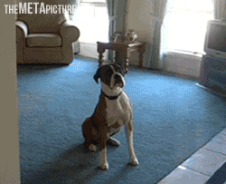

class: middle center 

```{r xaringan-themer, include=FALSE, warning=FALSE}
library(xaringanthemer) # Custom 'xaringan' CSS Themes

style_duo_accent(
  colors = c(
    red = "red",
    purple = "#3e2f5b",
    lightpurple = "#DCD0FF",
    lavender = "#967bb6",
    violet = "#8A2BE2",
    periwinkle = "#ccccff",
    orange = "#FF5733", # Orange - Innovation and Excitement
    green = "#136f63", # Teal - Creativity and Growth
    white = "#FFFFFF",
    yellow = "yellow", # Yellow - Optimism and Energy:
    gold = "gold",
    turquoise = "#00C5CD", # Turquoise - Balance and Clarity:
    aquamarine = "#7FFFD4",
    teal = "#2c8475",
    darkgreen = "#006400",
    forestgreen = "forestgreen",
    firebrick = "firebrick",
    lightcoral = "lightcoral",
    black = "black",
    charcoal = "#36454F",
    purple = "#7030A0", # Purple (#7030A0) - Imagination and Open-mindedness
    blue = "#0070C0", #Blue - Persuasion and Trust:
    cornflowerblue = "cornflowerblue",
    deepskyblue = "deepskyblue",
    dodgerblue = "dodgerblue",
    steelblue = "steelblue",
    royalblue = "royalblue"),
  primary_color = "black",  
  secondary_color = "#FFFFFF",
  # secondary_color = "yellow",
  black_color = "#000004",
  white_color = "#FFFFFF",
  base_font_size = "20px",
  text_font_family = "Jost",
  text_font_url = "https://indestructibletype.com/fonts/Jost.css",
  header_font_google = google_font("Roboto Slab", "400", "700"),
  header_font_weight = "400",
  inverse_background_color = "black",
  # inverse_header_color = "#eaeaea",
  inverse_header_color = "#FFFFFF",
  title_slide_text_color = "#FFFFFF",
  text_slide_number_color = "#FFFFFF",
  text_bold_color = "#FF5733",
  code_inline_color = "#FFFFFF",
  code_highlight_color = "transparent",
  link_color = "lightcoral",
  text_color = "ivory",
  header_color = "#FFFFFF",
  background_color = "black",
  blockquote_left_border_color = "steelblue",
  # table_row_even_background_color = lighten_color("white", 0.9),
  extra_fonts = list(
    "https://indestructibletype.com/fonts/Jost.css",
    google_font("Amatic SC", "400")
    )
)

```


```{r LIBRARIES, echo=FALSE, include=FALSE, warning=FALSE}
####
library(ggplot2) 
library(tibble) 
library(tidyr) 
library(readr) 
library(purrr) 
library(dplyr) 
library(stringr) 
library(forcats) 
library(lubridate) 
####
library(xaringan) 
library(xaringanExtra) 
library(xaringanthemer) 
library(countdown) 
library(htmltools) 
library(htmlwidgets) 
library(here) 
library(knitr) 
library(kableExtra) 
library(DT) 
library(shrtcts) 
library(xaringanmediacalls)
library(renderthis)
```

```{r xaringanExtra, echo = FALSE, warning = FALSE}
xaringanExtra::use_animate_css()
xaringanExtra::use_animate_all("fade")
xaringanExtra::use_banner()
xaringanExtra::use_clipboard()
xaringanExtra::use_editable(expires = 1)
xaringanExtra::use_extra_styles()
xaringanExtra::use_fit_screen()
# xaringanExtra::use_freezeframe()
xaringanExtra::use_panelset()
xaringanExtra::use_progress_bar()
xaringanExtra::use_scribble()
xaringanExtra::use_search()
xaringanExtra::use_share_again()
# xaringanExtra::use_slide_tone()  # not yet a feature I like
xaringanExtra::use_tile_view()
xaringanExtra::use_webcam()
xaringanExtra::use_tachyons()

```


```{r xaringanExtra-use_banner, echo=FALSE}
xaringanExtra::use_banner(
  top_left = "Banner Top Left",
  top_right = "Banner Top Right",
  bottom_left = "bit.ly/my-awesome-talk",
  exclude = "title-slide"
  )

```

```{r xaringanExtra-style_banner, echo=FALSE}
xaringanExtra::style_banner(
    text_color = "red",
    background_color = NULL,
    padding_horizontal = NULL,
    padding_vertical = NULL,
    height = NULL,
    width = NULL,
    font_size = NULL,
    font_family = NULL,
    z_index = NULL,
    selector = NULL
  )

```


```{r xarington Countdown WHEN YOU NEED ONE, echo=FALSE}
# countdown::countdown(
#           minutes = 0,
#           seconds = 90,
#           warn_when = 5
#           style = "position: relative; width: min-content; margin: 1em auto;",
#           top = 0, bottom = 0,
#           left = 0, right = 0,
#           margin = "5%",
#           font_size = "8em",
#           color_running_background = "#31b09e",
#           color_warning_background = "#f79334",
#           color_finished_background = "#b56b6f",
#           color_finished_text = "#eaeaea"
#           # Fanfare when it's over
#           play_sound = TRUE
#
```

```{r setup, include=FALSE}
options(htmltools.dir.version = FALSE, htmltools.preserve.raw = FALSE)
knitr::opts_chunk$set(echo = FALSE)

```
<span style="font-size: 80px; font-weight: 400;">.char[Business Workshops and Consulting]</span>

by

.f1.gold[Dan Swart, .i.o[Business Developer]]

.tq["Practical Advice ~ Exceptional Results"]

---
class: top

# Today's workshop is brought to you by the letter .f-5.b.char["U"] 

.pull-left[

<br>
.f-5.b[.cfb["Unique!"]]
]

.pull-right[


]

---
class: left middle

.f-6[# WHY ARE WE HERE TODAY?]

---
class: middle

.pull-left[

.f-5.char[To]  
<span style="font-size: 120px;">**LEARN**</span>

]

.pull-right[


]

---
class:   

.pull-left[

.f1.char[
to have <span style="font-size: 140px;">**FUN**</span>]



]

.pull-right[


]

---
class:   

.pull-right[


.f1.char[And, to] 

<span style="font-size: 65px;">**MAKE A DIFFERENCE!**</span>
]

.pull-left.absolute.left-2.top-2[


]

---
class: bg-purple middle center     

<span style="font-size: 100px; font-weight: 400;">This workshop is designed specifically to help you .b.char[succeed]; so you .ul[can] .b.tq[make a difference]</span>

---
.f1.left[About me:]

.b.i.left.dsb[Dan Swart, Business Developer]

.left-column[]


.right-column.pb10[

I teach owners practical ways to make their companies even more .char[Effective], .o[Capable,] and .cfb[Unique] 

so they can turn all their hard work into .char[prosperity] for themselves and others, and .center[live a .char[better] life.]

]

---
class: top

# How to contact me:

<br>


.middle.center.f1.tq[`r fontawesome::fa("phone")` (916) 802-1040]  

<br>


.middle.center.f1.tq[`r fontawesome::fa("envelope", a11y = "sem")` dan@danswart.com]


---
class: middle center

.f-5.char[My Mission is to Create Happy Customers]


.f1[How About You?]

---
class: middle left     

<span style="font-size: 100px; font-weight: 400;">THE CHALLENGE WE FACE...</span>

---
class: top center


.f-5[How to become .b.cfb[Unique] in the marketplace]

--


.f1[Because the more .b.cfb[Unique] you are, the .char[more successfull] you can become]

---
class: middle center     

<span style="font-size: 100px; font-weight: 400;">In the Marketplace .b.char[Contrast] is .b.cfb[Power]</span>

---


# The best way to .char[contrast] with your competitors

--


.f1.center[ is to be .ul[very] .b.char[Effective] AND .ul[very] .b.o[Capable]]

--


.f1.right[
<span class="f1" style="color: turquoise">from your customer's point of view</span>]

---
class: top  

.pull-left[
.f-5[.cfb[Unique] means]


.f1.char[Standing out from the crowd]
]

.pull-right[


]

---
class: top  

.pull-left[
.f-5[.cfb[Unique] means]


.f1[being .b.char[unconventional]]


.o[('going against the grain')]
]

.pull-right[


.center[]

]

---
class: 

.f1.left[Avoid .red[conventional logic] because all your competitors will use that]

--

<br>
.f1.right.bottom[.char[Test counter-intuitive ideas] because your competitors won't]

---
class: middle center    

<span style="font-size: 100px; font-weight: 400;">What is the Best Way to .char['Stand Out'] and  .cfb[Be Unique?]</span>

---
class:


.f1[Create the unstoppable .char[chain reaction]:]

--


.center.f1[Become .ul[very] .char[Effective], then]

--

.left.f1[Build awesome .o[Capability] to deliver]

--

.f1.center[And you will be .cfb[irresistably Unique]]

---
class: middle center

.f-5[So, what does it mean to be .char["effective?"]]

---
class: top  

.pull-left[
.f-5.char[Effective] 


means .b.ul.gold[knowing] what creates .char[REAL] value for customers - .char[in their terms]

and having the .o[capability] to deliver it .o[upon demand]
]

.pull-right.bottom[


]

---
class: top center  

.f-5.b[.char[Effective] means...]

--


.f1.bottom.b[.f-5[Strictly] .char[from the customer's point of view]]

---
class:  


.f1[Your efforts must be .tq[Useful,] or] 


.f1.center[.tq[Fulfill a desire], or]


.f1.right[.tq[Solve a problem]]


.f1[From the .char[customer's point of view]]

---
class: middle center    


.f-5.b.char[Effective ] .f1[does .b.tq[NOT] mean 

.f-5.red[Expedient]]

---
class:  

.f1.b.red[Expedient =]


.f1.right[.y[Quick, ] .y[Interim ] or .y[Temporary]]


.f1.center[.y[Short-term], often at the expense of the long-term]


.f1.left[.y[Putting out fires,] .f1[often] .red[at the expense of the customer]
]

---
class: top center  

# Strangely, the opposite is .red[NOT] true:

.f-5[.y[Efficient] &ne; .char[Effective]
]

--

.f1[As you become more .char[Effective] you will .ul.tq[automatically] become more .char[efficient]]

---
class: top center

.f-5[.y[Productive] &ne; .char[Effective]
]

--


.f1[As you become more .char[Effective] you will .ul.tq[automatically] become more .char[productive]]

---
class:  top center

# But, don't just take my word for it...

--

<br>
# Let's hear what .dsb[Warren Buffet] thinks about .char[Effectiveness] in delighting customers

---
class: middle center

<iframe width="1000" height="750" src="https://www.youtube.com/embed/YUn7xTL4k6o?si=oIjmeeDb0HIKWYX3&rel=0" title="YouTube video player" frameborder="0" allow="accelerometer; autoplay; clipboard-write; encrypted-media; gyroscope; picture-in-picture; web-share" allowfullscreen></iframe>

---
class: middle center     

.royalblue[
<span style="font-size: 100px; font-weight: 400;">Some Cold, Hard Facts...</span>
]


---
class: center

# .tq[Half] of new businesses .red[fail] in .o[5 years].  

--

# By .tq[year 10] fully .red[two-thirds] are .o[gone].  

--

# Only .red[10%] make it to .o[20 years].  

---
class:  

.f1.center[Studies and surveys also show shocking .red[failure rates] for .tq[improvement initiatives] that can range from 

.center.f1[.red[50% to 70%] or **even higher.**]]

---
class: top center

# If you are .tq[ambitious and flexible,]

# this is all .char[good news] for you!

--

# * If you become .char[Effective] enough, 

--

# * If you become .o[Capable] enough,

--

<br>
# * You .lc[will] become .cfb[Unique] enough.

---
class: center

# .y[It’s not remarkable that companies fail.]  

--

.f-5[It’s remarkable that they .red[fail so often, .f-5.white[and have] for so long!]] 

---
class: center

# .tq[Obviously,] we make the same mistakes **over and over again** 

--

<br>
# .tq[Otherwise,] those grim survival statistics would have improved long ago,

.f1.char[RIGHT?]

---
class:

.pull-left[


]


.pull-right[


.f1[ And what about the companies that are just surviving?]


.f1.y[They are neither fully alive nor completely dead]
]

---
class: top center

.f1[This is not a laziness problem, or an intelligence problem.]  

--


.f1[Most business owners are very hard-working, and good at what they do.]

--


.f1.char[Right?]

---
class: middle center

# But they’re not very good at turning all that hard work

# into .char[prosperity] and a .char[better life] 


.f1.red[are they?]

---
class: middle center     

<span style="font-size: 100px; font-weight: 400;">Where Companies Go .red[Wrong]</span>

---
class: top center

<span style="font-size: 100px; font-weight: 400;">What?!</span>


---
class:  

.f-5[They are .red[‘Same-As’:]]

.pull-left[
<span style="font-size: 55px;">.y[EACH COMPANY JUST LIKE THE REST]</span>

.center.red[Afraid to be different]

]


.pull-right[


]

---
class:

.f1.center[.red['Same-As'] companies don't last long in the marketplace]

.center[

]

---
class: top  

# .f-5[They .red[Copy, Copy, Copy]]

.pull-left[


Everyone from business schools to self-help books continue to tell owners that .red[copying others] is the solution to their problems.
]

.pull-right[


]

---
class:

.f1.center[.red['Follow-the-Herd'] companies don't stand a chance in the marketplace]

.center[]

---
background-image: url(gif/people-over-cliff-like-lemings.gif)
background-size: cover

.f-5.b.red.center[Woo Hoo!  Let's do what everyone else does!]

---
class: middle center  

# .f1[
On top of that, most .y['Solutions'] are .red[Incompatible] with their existing systems]


---
class: middle center

.f1[For example, companies naturally adopt the style of management known as .red[‘command-and-control’]]


---
class: top  

.pull-left[

.f-4.y[Unfortunately]

<br>
most improvement schemes (and many company goals) are .b.red[incompatible] with this style of management] 


.pull-right.pt6[


]

---
class: middle center

.f1[So, most improvement efforts are .b.red[doomed] from the outset]


---
class:

.f1[So, what's a leader to do?]

--

### * Learn to be more .char[Effective,]
.right.char[in the eyes of your customers]

--

### * Learn to be more .o[Capable]
.right.o[in the eyes of your customers]

--

### * Learn to be more .cfb[Unique]
.right.cfb[in the eyes of your customers]

---
class:

.f1[These things hardly cost a thing...]

--


# * But, they require a .char[different mindset]

--


# * A sense of .char[urgency,] and

--


# * The willingness to .char[try new things]

---
class: middle center

<span style="font-size: 100px;">The reward is to become .b.cfb[Unique in the marketplace]</span>

---
class: middle center     

<span style="font-size: 100px; font-weight: 400;">.char[Which is the Point!]</span>

---
class:  middle center

.char[<span style="font-size: 100px; font-weight: 400;">.right.dsb[WHAT TO DO NOW?]</span>]

---
class:

.f-5[FIRST...]

--

# Adopt a .o[plain-spoken] aim such as .b.tq["Our Mission is to Create Happy Customers!"]

--

# Lose the .red[corporate-speak, gobbelty-gook jargon.]  It makes it .tq[much harder] for everyone to do a great job.

---
class: top  

.pull-left[.f1[Next... .f-5.char[Learn]]

<br>
.o[first-hand] what your customers value --

.center.char[from their point of view]
]

.pull-right.pt5[

]

---
class: top  

.pull-left[.f1[Next... .f-5.char[Learn]]

<br>
.o[first-hand,] what your customers experience .o[when dealing with your company]

.center.cfb[(the good, bad, and ugly)]
]

.pull-right.pt5[

]

---
class: bg-slategray 

# .white[Remember, management Is .f1.y[Not Very Good] at Guessing What Customers Value]

--

<br>
.f-5.center[So, it .b.char[PAYS .lc[(a lot)]] to Ask Them Directly]

---
class: top center bg-royalblue

.f-5.b.gold[Case Study]


.f1[Initially, Dr. T and her team came up with 23 ideas of creating more value for her customers]

---
class: middle center bg-royalblue

.f-5[Let's see how they did by themselves...]
---
class:
background-image: url(img/blank-all-4-quadrants.png)
background-size: contain

---
background-image: url(img/quadrants2and3.png)
background-size: contain

---
background-image: url(img/quadrants1and4.png)
background-size: contain

---
background-image: url(img/all-4-quadrants-with-dots.png)
background-size: contain

---
class: top center bg-royalblue   

.f-5.white[If there is any way at all]

--

.f-5.center[.b.char[Ask Customers Directly!]]

---
class: bg-royalblue middle center

.f-6[It .b.char[PAYS .lc[(a lot)]] to Ask Them Directly]

---
class: top  

.pull-left[

.f-5.dsb[Then...]

create .o[Capability] so customers can pull the value they need from you
<br>

.o[(when, where, and how they want to)]

]

.pull-right.pt5[

]

---
class: middle center bg-royalblue

.f-5.b.tq[Case Study]


.f1[Stew Leonard's Dairy has mastered the .o[ability] to .b.char['Listen, then Deliver']]

---
class:  middle center

<iframe width="1000" height="800" src="https://www.youtube.com/embed/lQ32eHkIIZ4?si=99AJl27fm1S2aRSj&rel=0" title="YouTube video player" frameborder="0" allow="accelerometer; autoplay; clipboard-write; encrypted-media; gyroscope; picture-in-picture; web-share" allowfullscreen></iframe>

---
class: middle center     

<span style="font-size: 100px; font-weight: 400;">Some Things To .red[AVOID]...</span>

---
class: top

# BEWARE OF...

--

## .red[Slogans,] and so-called .tq[‘best practices’,] 

--

## .lightcoral[Agile,] .deepskyblue[Lean,] or .red[Six-Sigma,]

--

## Mission & Vision statements full of .red[buzzwords,]

--

## .o[Servant leadership] 


.right.f1[These are  .y[management fads]]

---
class: middle center

.f1.center[They all avoid the responsibiltiy to <br><br>create and maintain a system based on <br><br>.char[Effectiveness] and .o[Capability]]

---
class: middle center fadeIn

.f-6[.b.dsb[GUIDING PRINCIPLES] 
for Action]

---
class: middle center    

# Apply your .dsb[GUIDING PRINCIPLES] **daily** to get

.f-5.b.char[AMAZING RESULTS]

---
class:  

.dsb[<span style="font-size: 90px; font-weight: 400;">GUIDING PRINCIPLE:</span>]

.f1.center.bottom[Focus on measures of  .char[Effectiveness] 

# ~

Not on measures of .red[Efficiency]
]

---
class:  

.dsb[<span style="font-size: 90px; font-weight: 400;">GUIDING PRINCIPLE:</span>]

.f1.center[Focus on measures of  .char[Effectiveness] 

# ~

Not measures of .red[Productivity]
]

---
class:  

.dsb[<span style="font-size: 90px; font-weight: 300;">GUIDING PRINCIPLE:</span>]

<br>
.center[When you focus on measures of  .char[Effectiveness] & .o[Capability] 

# ~

You will .tq[automatically] be more .gold[Efficient] and .gold[Productive]
]

---
class: top center  


.f-6[ To be .b.cfb[Unique]]
.f-6[You Must Be]
.f-6.b.char[Effective!]

--

# .b.char[(EVERY DAY)]

---
class: top center  

.f-6[ To be .b.cfb[Unique]]
.f-6[You Must Be]
.f-6.b.o[Capable!]

--

# .b.o[(EVERY DAY)]

---
class: top center

# If you're looking for a 'sure-fire', low-cost way to prosper in the marketplace...

--

# Become .cfb[very Unique] 

# by becoming .char[very Effective] 

--

# and .o[very Capable]

---
class:
background-image: url(gif/thank-you-boy-hugs-chicken.gif)
background-size: contain

.f-5.b.right.o[THANK YOU!]

.f-5.left.b.char[.left[Q]
.left[&] 
.left[A]
]

---
class:  middle center

<span style="font-size: 80px; font-weight: 400;">.char[Business Workshops and Consulting]</span>

.b[by]


.f1.b.db[Dan Swart]
.tq["Practical Advice ~ Exceptional Results"]

.f3[`(updated: `r Sys.Date()`)`]

---

<!-- POST PRODUCTION -->

<!-- To create list of media calls in the console run this code (include the .Rmd filename ext).  Then copy and paste from console to file and print: -->

<!-- xaringanmediacalls::ds_xaringan_media_calls("slidetemplate01.Rmd") -->

<!-- Render options described here:  https://jhelvy.github.io/renderthis/articles/renderthis.html -->

<!-- To render this slide show to pdf restart the R session and the run the following from the command line: -->

<!-- renderthis::to_pdf(from = "unique.Rmd", complex_slides = TRUE) -->

<!-- The pdf created by the code above will NOT contain the video elements.  If you want the video elements you must render the file using the 'Knit' button in RStudio.  Restart the R session first. -->

<!-- If 'self-contained = TRUE in the YAML, it is recommended to create local version of remarks.js library with this code: -->

<!-- xaringan::summon_remark(version = "latest", to = "libs/") -->

<!-- Currently, the chakra designation is commented out in the YAML.  Remove the comment # and knit to obtain a self-contained HTML file. -->

<!-- Workflow to deploy to GitHub Pages is here:  -->

<!-- https://rviews.rstudio.com/2021/11/18/deploying-xaringan-slides-a-ten-step-github-pages-workflow/ -->

<!-- Normally, START WITH STEP 9 -->

<!-- 1. usethis::create_project("filepath/for/your/presentation/repo-name") -->

<!-- 2. Create a xaringan deck using a xaringan template: -->
<!-- File > New File > R Markdown > From Template > Ninja Presentation > OK -->

<!-- 3. Delete what you don’t need and save your R Markdown file with whatever name you like. If you pick index.Rmd the live link you share at the end will be relatively short. -->

<!-- 4. Render HTML slides from the open Rmd file using xaringan’s infinite moon reader: -->

<!--   xaringan::infinite_moon_reader() -->

<!-- 5. Initialize version control of your slides with git (replace 'master' with 'main': -->

<!-- usethis::use_git() -->

<!-- 6. Connect your local project with a GitHub repo: -->

<!-- usethis::use_github() -->

<!-- 7. Your new GitHub repo with all of your xaringan project files will automatically open up in your browser -->

<!-- 8. Edit your slides as you wish. Commit often! And then push to GitHub. -->

<!-- 9. When you’re ready to deploy your slides, you can use the usethis::use_github_pages() function which makes the process of deploying via GitHub Pages super easy. I recommend pointing branch to the name of your primary branch. -->

<!-- usethis::use_github_pages(branch = "main") -->

<!-- 10. Visit the link provided to see your newly deployed slides! 🚀 -->
<!-- Don’t panic if you don’t see them right away, sometimes it takes a little time. This is the link you will share with the world when you present. Notice it looks very similar to your GitHub repo link.  -->

<!-- 11. Go to the repository home page and find the About section on the right hand side. Add a description of your presentation and the link to your slides, that way your presentation is easily available to anyone visiting your repo. -->

<!-- 12. Check out Garrick Aden-Buie’s blog post Sharing Your xaringan Slides to learn how to create a social media card for your slides and use your new link to share your slides in more places (e.g. embedded on a website, etc.) -->

<!-- FORMATTING -->

<!-- To create a space use:  &nbsp; -->
